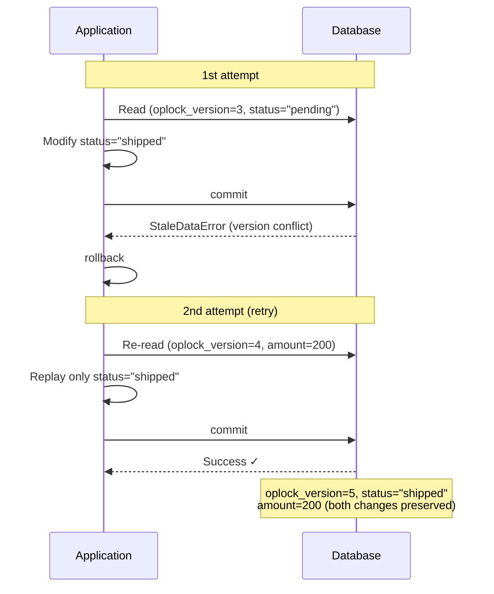

# Optimistic locking mechanism

::: tip Source location
`src/sqlmodel_ext/mixins/optimistic_lock.py` — `OptimisticLockMixin` and `OptimisticLockError`

The metaclass wiring lives in `src/sqlmodel_ext/base.py`; the retry logic lives in `save()` / `update()` / `delete()` in `src/sqlmodel_ext/mixins/table.py`
:::

## Why this exists

Concurrent updates on the same record cause **lost updates**: A modifies `status`, B simultaneously modifies `amount`, and whoever writes last overwrites the other's changes. Optimistic locking detects these conflicts via a version number, making them recognizable and retryable instead of silently dropping data.

Looking for **how to use it**? See [Handle concurrent updates](/en/how-to/handle-concurrent-updates). This chapter only explains **why** it's implemented this way.

## The version column: `oplock_version`

```python
class OptimisticLockMixin:
    __optimistic_retry_default__: ClassVar[int] = 3
    _has_optimistic_lock: ClassVar[bool] = True

    oplock_version: Annotated[
        int,
        Field(
            default=OPLOCK_INITIAL_VERSION,           # 0
            ge=0, le=JS_MAX_SAFE_INTEGER,
            sa_type=BigInteger,
            sa_column_kwargs={'server_default': text('0')},
            exclude=True,
        ),
    ] = OPLOCK_INITIAL_VERSION
```

Every design choice corresponds to a real problem:

| Choice | Reason |
|--------|--------|
| Column name `oplock_version` rather than `version` | Doesn't collide with a domain field named `version`. The name is **globally reserved**: any model declaring it in its own class body makes the metaclass raise `TypeError` on the spot — otherwise a class without locking could declare a domain column of that name, and a descendant that re-enables locking would silently wire it up as `version_id_col` |
| `BIGINT` + upper bound `JS_MAX_SAFE_INTEGER` | No realistic risk of INTEGER overflow on frequently updated rows; the bound is safe for JS clients |
| `exclude=True` | The version column is internal ORM state and should not leak into `model_dump()` (e.g. into a response DTO with `extra='forbid'`) |
| `server_default` | During a rolling deploy, instances of the old version don't know this column and don't write it on INSERT; the database default keeps those INSERTs valid |
| Default written inside the `Annotated` `Field` | A mixin is a plain class (no `model_fields`); a default given only via `=` assignment would be lost when the metaclass restores Annotated fields |

When the metaclass sees any base class with `_has_optimistic_lock=True`, it registers this column as SQLAlchemy's `version_id_col` on the **root table** mapper (STI/JTI subclasses share it through mapper inheritance). Every UPDATE then generates:

```sql
UPDATE ... SET ..., oplock_version = oplock_version + 1
WHERE id = ? AND oplock_version = ?
```

WHERE doesn't match (another transaction already changed it) → 0 rows affected → `StaleDataError`.

## Retry policy belongs to the model, not the call site

```python
class TableBaseMixin:
    __optimistic_retry_default__: ClassVar[int] = 0

class OptimisticLockMixin:
    __optimistic_retry_default__: ClassVar[int] = 3
```

`optimistic_retry_count` of `save()` / `update()` defaults to `None`, meaning "use the model's policy":

```python
retries_remaining = (
    optimistic_retry_count if optimistic_retry_count is not None
    else cls.__optimistic_retry_default__
)
```

- **Why not pass a parameter at every call site**: a policy should live where the capability is declared. Relying on every call site remembering to pass `optimistic_retry_count=3` means declaring the same fact in a second place — some place will always forget.
- **Why the base class uses 0**: for a model without optimistic locking, `StaleDataError` can only mean "the UPDATE hit 0 rows = the row no longer exists"; retrying would just report "deleted" again.
- **Why the mixin uses 3 and not more**: each retry is a full rollback + re-read + re-write; persistent conflicts mean real contention, and more retries only hold the connection longer.
- **Why the default can't be 0**: an explicit `0` must still mean "don't retry", so "not passed" needs a carrier distinct from 0 — `None`.
- **MRO requirement**: `OptimisticLockMixin` must come **before** `TableBaseMixin` / `UUIDTableBaseMixin`, so its `__optimistic_retry_default__` overrides the base class's 0.

## Retry in `save()`

```python
while True:
    # Snapshot scalar state before flush: a failed versioned UPDATE rolls back the inner transaction
    # and expires every attribute; reading an attribute in the except block would emit SQL (PendingRollbackError / MissingGreenlet).
    instance_id = <read from identity or __dict__>
    instance_version = instance.__dict__.get('oplock_version')
    if retries_remaining > 0 and current_data is None:
        # Record only the columns the caller actually modified (SQLAlchemy attribute history)
        current_data = {col: value for col in changed_columns if col not in ('id', 'oplock_version', 'created_at', 'updated_at')}

    session.add(instance)
    try:
        await session.commit()
        break
    except StaleDataError as e:
        await session.rollback()
        if retries_remaining <= 0:
            raise OptimisticLockError(..., record_id=..., expected_version=instance_version) from e
        retries_remaining -= 1
        fresh = await cls.get(session, cls.id == instance_id)
        if fresh is None:
            raise OptimisticLockError("... record has been deleted", ...) from e
        for key, value in current_data.items():
            setattr(fresh, key, value)
        instance = fresh
```

### Why only "the columns I changed" are replayed

The early implementation used the whole `model_dump()` as replay data. That wrote **the old values you read** back together with your changes, overwriting other columns another transaction had just committed — exactly the lost update optimistic locking is meant to prevent, just happening somewhere else. Now SQLAlchemy's attribute history (`history.has_changes()`) is used to collect only the columns the caller actually modified; for a new instance, every assigned attribute has history, so INSERTs are covered as well.

Retry in `update()` is simpler: its "changes" already are `other.model_dump(...)`, so after re-reading the latest row it just runs `sqlmodel_update` once more.

### Why snapshot before flush

When the conflict happens the inner transaction has already been rolled back and every attribute of the instance has expired. Any attribute read in the `except` block would emit SQL, while the session is in a pending-rollback state or outside the async context — so the id and version must be taken **before** attempting the flush, via the identity / `__dict__` (which doesn't trigger loading).

### Retry flow



## Conflicts in `delete()`: normalized, but not retried

For versioned models, `DELETE` also carries `WHERE oplock_version = ?`. When it hits 0 rows, `delete()` converts `StaleDataError` into `OptimisticLockError`, but:

- **Never retries.** "Someone just changed it — do I still want to delete it?" is the caller's decision, not something the framework can make for you.
- **`record_id` and `expected_version` are always `None`.** A flush covers the whole session: the conflict may come from the delete target, or from a versioned UPDATE of another object in the same flush. Putting the delete target into `record_id` would wrongly attribute someone else's conflict to it. `model_class` is the **caller's** model.
- **Doesn't roll back**: the transaction belongs to the caller.
- Condition mode (`delete(condition=...)`) never raises it: a bulk DELETE has no per-row version check.

## `OptimisticLockError`

```python
class OptimisticLockError(Exception):
    def __init__(self, message, model_class=None, record_id=None,
                 expected_version=None, original_error=None): ...
```

Carries `model_class` / `record_id` / `expected_version` / `original_error` (the original `StaleDataError`), for logging and troubleshooting. Which fields each source fills in is listed in the [Mixins reference](/en/reference/mixins#optimisticlockerror).

## Two-phase rollout

`_has_optimistic_lock` can be overridden to `False` on an **intermediate base class**: the model gets the `oplock_version` column, but the metaclass does not wire up `version_id_col`. This makes "ship the column first, ship the locking behavior later" two independent deploys — during the first deploy neither old nor new instances do version checks and the column is filled by `server_default`; the second deploy turns the check on.
