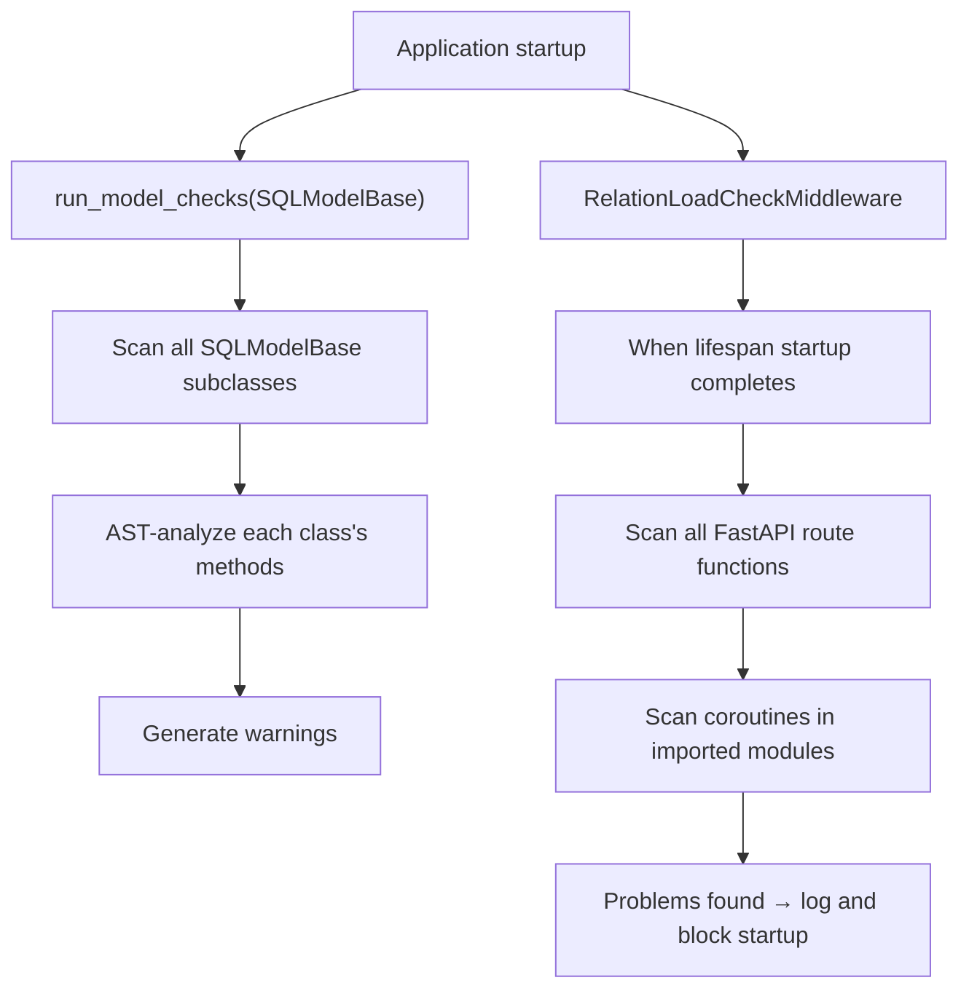

# Static analyzer internals

::: tip Source location
`src/sqlmodel_ext/relation_load_checker.py` — `RelationLoadChecker`, `RelationLoadCheckMiddleware`, `run_model_checks`
:::

This is the **most complex module** in the entire project. It uses AST static analysis to surface potential `MissingGreenlet` problems at application startup.

::: warning Experimental, disabled by default
This module is considered **experimental** and requires `rlc.check_on_startup = True` to opt in; the module API is not covered by the semver stability promise. This chapter explains **how it works**; for how to enable it in your project, see [Prevent MissingGreenlet errors](/en/how-to/prevent-missing-greenlet).
:::

## Core class

```python
class RelationLoadChecker:
    def __init__(self, base_class: type) -> None: ...

    def check_model_methods(self) -> list[RelationLoadWarning]: ...
    def check_app(self, app: Any) -> list[RelationLoadWarning]: ...
    def check_project_coroutines(
        self,
        project_root: str,
        skip_paths: list[str] | None = None,
        skip_third_party_attrs: bool = False,
        params_share_session: bool = True,
    ) -> list[RelationLoadWarning]: ...
    def check_function(self, func: Any) -> list[RelationLoadWarning]: ...
```

At construction it builds a knowledge base from the SQLAlchemy mappers (each model's relations, columns and relation targets), then **automatically discovers** method behavior — treating the type system as the single source of truth:

| Attribute | Meaning |
|-----------|---------|
| `commit_methods` | names of methods that (transitively) commit |
| `model_returning_methods` / `sync_model_returning_methods` | methods that return model instances |
| `refreshing_commit_methods` | commit methods whose return value comes from `save` / `update` (already refreshed) |
| `detaching_methods` | methods that (transitively) call `session.reset()` |

It uses Python's `ast` to analyze source code without executing it: no database connection needed, no business logic run.

## Analysis flow



`run_model_checks()` raises `RuntimeError` to block startup when it finds problems (in a pytest environment it only warns). The middleware runs the endpoint and coroutine checks once after lifespan startup completes, and likewise raises `RuntimeError` if there are problems.

## Detection rules

| Rule | Detects |
|------|---------|
| RLC001 | `response_model` contains relation fields, but the endpoint's query does not preload them |
| RLC002 | accessing relations after `save()` / `update()` without passing `load=` |
| RLC003 | accessing unloaded relations (only for locally obtained variables) |
| RLC005 | a dependency function does not preload the relations `response_model` needs |
| RLC007 | accessing column attributes of an expired object after commit |
| RLC008 | calling methods on an expired object after commit (the method may access expired columns internally) |
| RLC009 | type annotation resolution failure (mixing resolved types with string forward references) |
| RLC010 | passing an expired post-commit object as an argument to a function / method |
| RLC011 | relation access triggered implicitly by dunders (`if not obj:` → `__len__()`, `for x in obj:` → `__iter__()`) |
| RLC012 | `response_model` contains columns specific to an STI subclass, while the endpoint returns an STI base-class query result |
| RLC013 | an async generator accesses column attributes after `yield` (the consumer may commit with the same session during the yield) |
| RLC014 | a FastAPI `Depends` commits in its body, so the ORM objects injected by **sibling** dependencies are already expired when the endpoint starts |

### RLC014: commit at the dependency boundary

```python
async def get_article(session: SessionDep, article_id: UUID) -> Article:
    return await Article.get_exist_one(session, article_id)

async def touch_last_seen(session: SessionDep, user: CurrentUserDep) -> None:
    user.last_seen_at = datetime.now(timezone.utc)
    await user.save(session)                      # commit → every object in the session expires

@router.get("/articles/{article_id}")
async def read_article(
    article: Annotated[Article, Depends(get_article)],
    _: Annotated[None, Depends(touch_last_seen)],
) -> ArticleResponse:
    return ArticleResponse(title=article.title)   # RLC014: article is expired
```

Dependency resolution order is not guaranteed, and `expire_on_commit=True` makes one commit expire **all** objects in the session, so a commit inside any dependency expires the objects injected by other dependencies. Which method names count as "a commit inside a dependency" is decided by the module-level setting `dependency_commit_methods` (see below).

## Premises of the expiry model

RLC007 / 008 / 010 / 013 / 014 share the following modeling premises:

1. **Session parameters are recognized by subclass, not identity.** A parameter annotated with any subclass of sqlmodel's `AsyncSession` (including `sqlmodel_ext.AsyncSession`) counts as a session parameter. Judging by identity would make every method annotated with a subclass invisible to commit / detach / model-returning discovery. String forward references are accepted only for a segment that is **exactly** `'AsyncSession'` — no fuzzy matching, because unrelated HTTP clients are often called `AsyncSession` too.
2. **Expiry is per session identity.** A commit expires tracked objects only when the session passed to the commit method is the analyzed function's **own** session parameter; passing a short-lived local session (`async with factory() as s`) does not expire objects on the signature session. With several session parameters, committing one only expires the objects bound to it.
3. **Two kinds of conditional commit** (different semantics, configured separately):
   - `conditional_commit_methods`: methods that commit only on a cache miss and are pure reads in steady state (lazily created singletons, idempotent get-or-create). The call site can't tell hit from miss, so the whole method is **excluded** from commit discovery — accepting missed rare miss-commits in exchange for zero false positives in steady state.
   - `explicit_commit_methods`: methods declared with `commit: bool = False` that commit only when the caller passes `commit=True`. The call site **can** tell, so each call is judged by its own arguments: only a literal `commit=True` counts as a commit; dynamic values are treated as "no commit" (it cannot be proven true).
   - Rule of thumb: if the call site can statically see whether this call commits, use the latter; otherwise use the former.
4. **Detached after reset.** After `session.reset()` (directly or via a detaching method) objects are detached: already loaded column values are still readable, and later commits can **no longer** expire them. Otherwise the correct pattern "reset releases the connection → a short session persists → keep reading columns of the detached object" would be falsely reported as RLC007/010.
5. **Test code is resolved via pytest fixtures.** With `check_project_coroutines(params_share_session=False)`, a model parameter of a test function is considered to share the session if and only if the transitive dependency closure of its fixture consumes the **name** of some session fixture the test itself requests; ad-hoc constructions, fixtures that open their own session, and fixtures whose definition can't be found are all modeled as detached. The default `True` suits production code (dependencies / callers assemble parameters on the same session, and a commit in the function body expires them).

## Module-level configuration

```python
import sqlmodel_ext.relation_load_checker as rlc

rlc.check_on_startup = True
rlc.conditional_commit_methods = frozenset({'get_or_create'})
rlc.explicit_commit_methods = frozenset({'enqueue'})
rlc.dependency_commit_methods = rlc.dependency_commit_methods | {'approve'}
```

| Setting | Default | Description |
|---------|---------|-------------|
| `check_on_startup` | `False` | master switch; when off, `run_model_checks`, the middleware and all automatic checks return immediately |
| `conditional_commit_methods` | `frozenset()` | see premise 3 above; matched by method name across all classes, so only list names that have this semantics throughout the whole project |
| `explicit_commit_methods` | `frozenset()` | see premise 3 above. Do **not** list methods whose `commit` parameter defaults to `True` (this library's `save` / `update` / `delete` / `add`) here |
| `dependency_commit_methods` | `{'add', 'save', 'update', 'delete'}` | method names that trigger RLC014 when called inside a FastAPI dependency. Only include methods that (almost) always commit; they must also be auto-discovered commit methods to take effect (intersected with `commit_methods`, guarding against same-named non-committing methods) |

`RelationLoadChecker.detaching_methods` is an auto-discovered result (not configuration), used to decide the detach exemption.

## Details of endpoint analysis

- **Discriminated unions are really bound**: a `response_model` of the form `Annotated[A | B | C, Discriminator(...)]` binds each member to the STI subclass it actually serializes, using the discriminator field's `Literal` value, and checks each separately.
- **Container drill-down**: `ListResponse[X]` and named bucket / page models (whose fields are lists of DTOs) are drilled down to the element DTO through the **field annotations** (`typing.get_origin/get_args` get no information from Pydantic concrete generics or named containers); Unions (`A | B`) are merged member by member.
- **`load=` is resolved at runtime**: closure free variables of dependency factories (the checker body returned by `require_x(X, load=rel(X.y))` says `load=load`), constants imported from other modules (`load=PRELOAD`), arguments bound by `functools.partial` — these forms, invisible to AST, are resolved from the function's **runtime namespace**. Name ownership follows CPython's own rules (`co_freevars` / `co_varnames`): a local name is **never** looked up in the globals, otherwise a same-named global constant would mask a real missing load.

## `# noqa` suppression

```python
return result  # noqa: RLC007
return result  # noqa: RLC007, RLC010
```

**Every** warning returned by `check_app` / `check_model_methods` / `check_project_coroutines` / `check_function` has already been filtered by `# noqa: RLCxxx`. Put `# noqa` on **the line the warning reports**:

- Rules that point at a specific access (e.g. RLC007, RLC014) report the line of the access; put `# noqa` on that line;
- Endpoint-level rules (e.g. RLC005: no matching `load=` found in either the dependencies or the endpoint body) are anchored on the first line returned by `inspect.getsourcelines` — which includes decorators — so put it on **the first decorator's line**:

```python
@router.get("/x", response_model=XResponse)  # noqa: RLC005
async def x(...): ...
```

## `RelationLoadWarning`

```python
@dataclass
class RelationLoadWarning:
    code: str       # "RLC001" ~ "RLC014"
    file: str
    line: int
    message: str
    # str(w) == "[RLC001] path/to/file.py:42 - ..."
```

## `mark_app_check_completed()`

The middleware check executes only once and is marked done via `mark_app_check_completed()`. If checking is enabled and the model checks ran but the endpoint checks did not, a reminder to add the middleware is printed to stderr at process exit.

## Why AST instead of runtime checks?

| Approach | Pros | Cons |
|----------|------|------|
| AST static analysis | Finds issues at startup, no code execution, covers all paths | Possible false positives, can't analyze dynamic code |
| Runtime checks | 100% accurate | Only checks executed paths |

The static analyzer serves as the "first line of defense" alongside runtime `@requires_relations` and `lazy='raise_on_sql'`, forming multi-layer protection.

## Known limitations

- **Response DTOs that don't inherit a table class can't have RLC001 / RLC005 requirements detected**: for a DTO, the analyzer uses the **nearest table model** in its MRO to decide whether a field corresponds to a relation. A response DTO declared fully independently, inheriting no table class, has no such anchor, and the relations it needs are not recognized.
- **False positives**: static analysis cannot track runtime dynamic behavior (`getattr`, conditional loading).
- **Coroutines only**: synchronous functions are out of scope.
- **Module scope**: only imported modules are analyzed.
- **Project structure assumptions**: the AST rules are tuned for a specific structure (FastAPI endpoints, STI inheritance conventions, `save` / `update` / `delete` naming) and may produce false positives or fail to parse on different projects.
