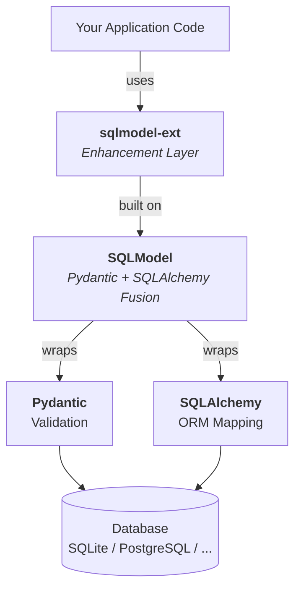

# Quick Start

## What is sqlmodel-ext?

**sqlmodel-ext** is an enhancement library built on top of [SQLModel](https://sqlmodel.tiangolo.com/), eliminating boilerplate code in async database applications.

**Define models, inherit Mixins, get a complete async CRUD API.**

## Tech Stack



## What Pain Points Does It Solve?

Writing CRUD APIs with raw SQLModel requires repeating a lot of code for every endpoint:

```python
# Three lines for every create
session.add(user)
await session.commit()
await session.refresh(user)

# List query: COUNT + SELECT + offset/limit/order_by + time filtering
# Partial update: model_dump + setattr loop + commit
```

sqlmodel-ext wraps these operations into **one-line calls**:

```python
user = await user.save(session)                              # Create/Update
users = await User.get(session, fetch_mode="all")            # Query
result = await User.get_with_count(session, table_view=tv)   # Paginated list
user = await user.update(session, update_data)               # Partial update
```

## Installation

```bash
pip install sqlmodel-ext
```

Install with [FastAPI](https://fastapi.tiangolo.com/) support (auto-raises `HTTPException` in `get_exist_one()`):

```bash
pip install sqlmodel-ext[fastapi]
```

PostgreSQL ARRAY and JSONB type support (requires `orjson`):

```bash
pip install sqlmodel-ext[postgresql]
```

pgvector + NumPy vector support (also installs `[postgresql]`):

```bash
pip install sqlmodel-ext[pgvector]
```

## Basic Usage

### 1. Define Models

```python
from sqlmodel_ext import SQLModelBase, UUIDTableBaseMixin, Str64

# Pure data model (no table, used for API input/output)
class UserBase(SQLModelBase):
    name: Str64
    email: str

# Table model (creates table, has CRUD capabilities)
class User(UserBase, UUIDTableBaseMixin, table=True): # [!code highlight]
    pass
```

### 2. CRUD Operations

```python
from sqlmodel.ext.asyncio.session import AsyncSession

async def demo(session: AsyncSession):
    # Create
    user = User(name="Alice", email="alice@example.com")
    user = await user.save(session)

    # Query
    user = await User.get_exist_one(session, user.id)  # Auto 404 if not found

    # Update
    user = await user.update(session, UserUpdate(name="Bob"))

    # Delete
    await User.delete(session, user)

    # Paginated list
    result = await User.get_with_count(session, table_view=table_view)
    # result.count = 42, result.items = [...]
```

### 3. Using with FastAPI

```python
from fastapi import APIRouter, Depends
from typing import Annotated
from sqlmodel_ext import ListResponse, TableViewRequest

router = APIRouter()
TableViewDep = Annotated[TableViewRequest, Depends()]

@router.post("", response_model=UserResponse)
async def create_user(session: SessionDep, data: UserCreate):
    user = User(**data.model_dump())
    return await user.save(session)

@router.get("", response_model=ListResponse[UserResponse])
async def list_users(session: SessionDep, table_view: TableViewDep):
    return await User.get_with_count(session, table_view=table_view)

@router.get("/{id}", response_model=UserResponse)
async def get_user(session: SessionDep, id: UUID):
    return await User.get_exist_one(session, id)

@router.patch("/{id}", response_model=UserResponse)
async def update_user(session: SessionDep, id: UUID, data: UserUpdate):
    user = await User.get_exist_one(session, id)
    return await user.update(session, data)

@router.delete("/{id}")
async def delete_user(session: SessionDep, id: UUID):
    user = await User.get_exist_one(session, id)
    await User.delete(session, user)
```

## Feature Overview

| Feature | Description | Details |
|---------|-------------|---------|
| [Field Types](./field-types) | Predefined types like `Str64`, `Port`, `HttpUrl`, `SafeHttpUrl` | Type list & usage |
| [CRUD Operations](./crud) | `save`, `get`, `update`, `delete`, `count`, `get_with_count` | Method reference |
| [Pagination & Lists](./pagination) | `ListResponse`, `TableViewRequest`, DTO Mixins | Pagination integration |
| [Polymorphic Inheritance](./polymorphic) | JTI (Joined Table) & STI (Single Table) inheritance | Configuration guide |
| [Optimistic Locking](./optimistic-lock) | Version-based concurrency control | Usage patterns |
| [Relation Preloading](./relation-preload) | `@requires_relations` declarative loading, `@requires_for_update` lock validation | Decorator usage |
| [Redis Caching](./cached-table) | `CachedTableBaseMixin` auto-caches query results to Redis | Cache integration |
| [Static Analyzer](./relation-load-checker) | Detects potential MissingGreenlet issues at startup | Configuration |

## Other Base Classes

### `ExtraIgnoreModelBase` — Handling External Data

Unlike `SQLModelBase` (`extra='forbid'`, raises error on unknown fields), `ExtraIgnoreModelBase` silently ignores unknown fields while logging a WARNING:

```python
from sqlmodel_ext import ExtraIgnoreModelBase

class ThirdPartyResponse(ExtraIgnoreModelBase):
    status: str
    data: dict
    # Unknown fields added by the third-party API are ignored but logged
```

Ideal for: third-party API responses, WebSocket messages, external JSON inputs where the schema may change.

::: tip Tip
Interested in how the framework works internally? Check out the [Implementation Internals](/en/internals/) section.
:::
