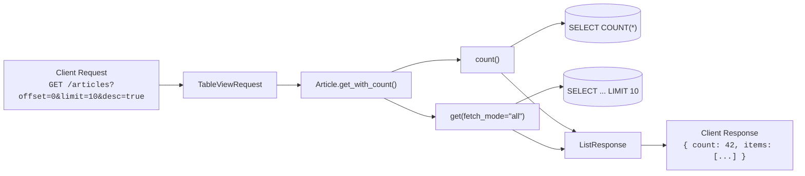

# Pagination & Lists

sqlmodel-ext provides four data models for handling pagination requests and responses, along with a set of DTO Mixins for API responses.

## Request Models

### `PaginationRequest` — Pagination & Sorting

```python
from sqlmodel_ext import PaginationRequest

class PaginationRequest(SQLModelBase):
    offset: int | None = Field(default=0, ge=0)            # Skip first N records
    limit:  int | None = Field(default=50, le=100)          # Max N records per page
    desc:   bool | None = True                              # Descending order
    order:  Literal["created_at", "updated_at"] | None = "created_at"
```

Default behavior: ordered by `created_at` descending, 50 per page, max 100.

### `TimeFilterRequest` — Time Filtering

```python
from sqlmodel_ext import TimeFilterRequest

class TimeFilterRequest(SQLModelBase):
    created_after_datetime:  datetime | None = None   # created_at >= this value
    created_before_datetime: datetime | None = None   # created_at < this value
    updated_after_datetime:  datetime | None = None   # updated_at >= this value
    updated_before_datetime: datetime | None = None   # updated_at < this value
```

Uses half-open intervals `[after, before)`. Built-in validation: `after` must be less than `before`.

### `TableViewRequest` — Combined

```python
from sqlmodel_ext import TableViewRequest

class TableViewRequest(TimeFilterRequest, PaginationRequest):
    pass  # Carries both pagination and time filtering parameters
```

## Response Model

### `ListResponse[T]` — Paginated Response

```python
from sqlmodel_ext import ListResponse

class ListResponse(BaseModel, Generic[ItemT]):
    count: int           # Total records matching the condition
    items: list[ItemT]   # Data list for the current page
```

## Using with FastAPI

```python
from typing import Annotated
from fastapi import Depends
from sqlmodel_ext import ListResponse, TableViewRequest

TableViewDep = Annotated[TableViewRequest, Depends()] # [!code highlight]

@router.get("", response_model=ListResponse[ArticleResponse])
async def list_articles(
    session: SessionDep, table_view: TableViewDep,
) -> ListResponse[Article]:
    return await Article.get_with_count( # [!code focus]
        session, # [!code focus]
        Article.is_published == True, # [!code focus]
        table_view=table_view, # [!code focus]
    ) # [!code focus]
```

Client sends:

```
GET /articles?offset=0&limit=10&desc=true&created_after_datetime=2024-01-01T00:00:00
```

Response JSON:

```json
{
  "count": 42,
  "items": [
    { "id": "a1b2c3d4-...", "title": "Hello World", "..." : "..." }
  ]
}
```

## Response DTO Mixins

Mixins for API response models, where fields are required (data is already persisted, values are guaranteed):

```python
from sqlmodel_ext import UUIDIdDatetimeInfoMixin

class ArticleBase(SQLModelBase):
    title: Str64
    body: Text10K

# Table model
class Article(ArticleBase, UUIDTableBaseMixin, table=True):
    author_id: UUID = Field(foreign_key='user.id')

# Response DTO
class ArticleResponse(ArticleBase, UUIDIdDatetimeInfoMixin):
    author_id: UUID
```

Available DTO Mixins:

| Mixin | Fields |
|-------|--------|
| `IntIdInfoMixin` | `id: int` |
| `UUIDIdInfoMixin` | `id: UUID` |
| `DatetimeInfoMixin` | `created_at: datetime`, `updated_at: datetime` |
| `IntIdDatetimeInfoMixin` | `id: int` + timestamps |
| `UUIDIdDatetimeInfoMixin` | `id: UUID` + timestamps |

## Data Flow Overview


