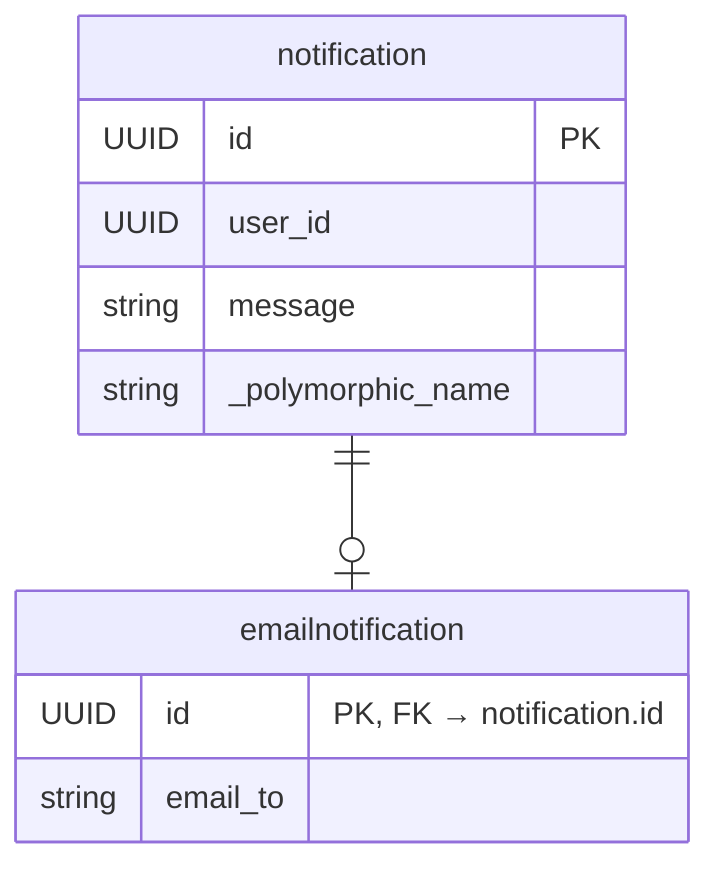
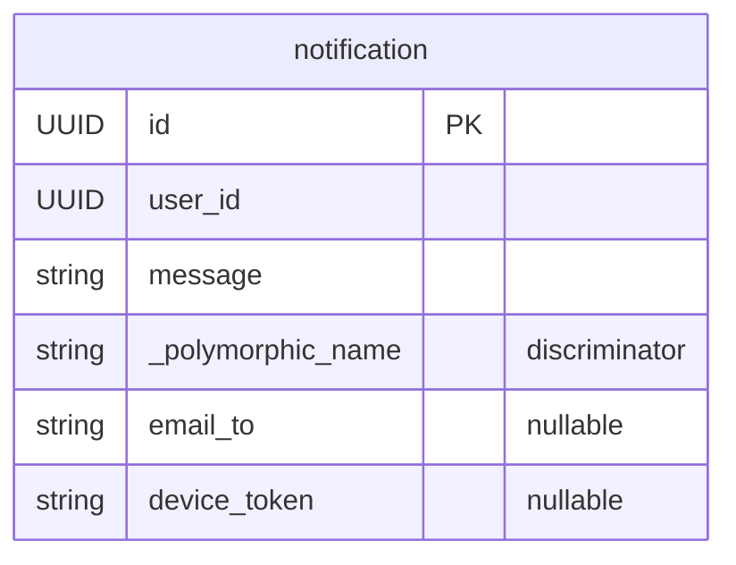

# Polymorphic Inheritance

Polymorphic inheritance lets different types of records share base fields while each having their own specialized fields. Queries automatically return the correct subclass instances.

## When Do You Need Polymorphism?

When multiple types of objects share the same base fields but each has additional specialized fields. For example, a notification system:

- All notifications have `user_id` and `message`
- Email notifications additionally have `email_to`
- Push notifications additionally have `device_token`

## Two Modes

### Joined Table Inheritance (JTI)

Each subclass has its own table, linked to the parent table via foreign key. **Use when subclass fields differ significantly.**



### Single Table Inheritance (STI)

All subclasses share one table. **Use when subclasses have few extra fields (1~2).**



## JTI Usage

```python
from abc import ABC, abstractmethod
from sqlmodel_ext import (
    SQLModelBase, UUIDTableBaseMixin,
    PolymorphicBaseMixin, AutoPolymorphicIdentityMixin,
    create_subclass_id_mixin,
)

# 1. Base class (fields only, no table)
class ToolBase(SQLModelBase):
    name: str

# 2. Abstract parent (creates parent table 'tool')
class Tool(ToolBase, UUIDTableBaseMixin, PolymorphicBaseMixin, ABC):
    @abstractmethod
    async def execute(self) -> str: ...

# 3. Create foreign key Mixin (id → tool.id)
ToolSubclassIdMixin = create_subclass_id_mixin('tool')

# 4. Concrete subclasses (each creates its own table)
class WebSearchTool(ToolSubclassIdMixin, Tool, AutoPolymorphicIdentityMixin, table=True):
    search_url: str
    async def execute(self) -> str:
        return f"Searching {self.search_url}"

class CalculatorTool(ToolSubclassIdMixin, Tool, AutoPolymorphicIdentityMixin, table=True):
    precision: int = 2
    async def execute(self) -> str:
        return "Calculating..."
```

::: warning Warning
`ToolSubclassIdMixin` must be placed **first** in the inheritance list so its `id` field (with foreign key) overrides `UUIDTableBaseMixin`'s `id`.
:::

Queries automatically return the correct subclass:

```python
tools = await Tool.get(session, fetch_mode="all")
# tools[0] is a WebSearchTool instance // [!code highlight]
# tools[1] is a CalculatorTool instance // [!code highlight]
await tools[0].execute()  # Calls the subclass method
```

## STI Usage

```python
class UserFile(SQLModelBase, UUIDTableBaseMixin, PolymorphicBaseMixin, table=True):
    filename: str

class PendingFile(UserFile, AutoPolymorphicIdentityMixin, table=True):
    upload_deadline: datetime | None = None   # nullable, added to userfile table // [!code highlight]

class CompletedFile(UserFile, AutoPolymorphicIdentityMixin, table=True):
    file_size: int | None = None              # nullable, added to userfile table // [!code highlight]

# After all model definitions (before/after configure_mappers):
from sqlmodel_ext import (
    register_sti_columns_for_all_subclasses,
    register_sti_column_properties_for_all_subclasses,
)
register_sti_columns_for_all_subclasses()       # Phase 1: add columns // [!code warning]
# configure_mappers() ...
register_sti_column_properties_for_all_subclasses()  # Phase 2: add properties // [!code warning]
```

::: warning Warning
`register_sti_columns_for_all_subclasses()` must be called **before** `configure_mappers()`, and `register_sti_column_properties_for_all_subclasses()` must be called **after**.
:::

STI subclass fields are automatically added as nullable columns to the parent table.

## Key Components

| Component | Purpose |
|-----------|---------|
| `PolymorphicBaseMixin` | Adds discriminator column `_polymorphic_name`, auto-configures `__mapper_args__` |
| `AutoPolymorphicIdentityMixin` | Auto-generates `polymorphic_identity` (lowercase class name) |
| `create_subclass_id_mixin(table)` | Generates an ID Mixin with foreign key (JTI only) |

## JTI vs STI Selection

| Consideration | Choose JTI | Choose STI |
|---------------|-----------|-----------|
| Many extra fields per subclass | Yes | |
| Few extra fields (1~2) | | Yes |
| Frequent queries across all types | | Yes (no JOIN needed) |
| High data independence requirement | Yes | |
| Clean table structure | Yes (compact tables) | No (one wide table) |
