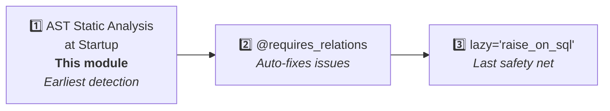

# Static Analyzer

::: warning Experimental (off by default)
Starting with 0.3.0 the relation-load static analyzer is **experimental** and
ships with `check_on_startup = False`. Every auto-check entry point
(`run_model_checks`, `RelationLoadCheckMiddleware`, the `atexit` warning)
short-circuits immediately and the analyzer has no effect on your app.

The analyzer's AST rules are tuned for a specific project layout (FastAPI
endpoints, STI inheritance conventions, `save`/`update`/`delete` naming, and
more). On projects that deviate from those assumptions it may emit false
positives or fail to parse source files. Only enable it after verifying that
your project matches the assumptions described below:

```python
import sqlmodel_ext.relation_load_checker as rlc
rlc.check_on_startup = True  # explicit opt-in, experimental
```

The module API is not covered by semver stability guarantees; rules and
signatures may change in subsequent releases.
:::

The static analyzer uses AST analysis to scan source code **at application startup**, detecting code that could cause `MissingGreenlet` errors before any request is served.

## Purpose

This is the **first line of defense** against MissingGreenlet issues — scanning your code before any requests arrive to find all potential problems.



## Detection Rules

| Rule | Description |
|------|-------------|
| **RLC001** | `response_model` contains relation fields but endpoint doesn't preload |
| **RLC002** | Accessing relations after `save()`/`update()` without `load=` |
| **RLC003** | Accessing relations without prior `load=` loading (local variables only) |
| **RLC005** | Dependency function doesn't preload relations needed by `response_model` |
| **RLC007** | Accessing column attributes on expired objects after commit (triggers sync lazy load → MissingGreenlet) |
| **RLC008** | Calling business methods on expired objects after commit (method body may touch expired columns) |
| **RLC010** | Passing expired ORM objects after commit as arguments into other functions/methods |
| **RLC011** | Implicit dunder access (`if not obj:` → `__len__`, `for x in obj:` → `__iter__`) triggers relation load |
| **RLC012** | `response_model` declares STI-subclass-specific columns but the endpoint returns STI base-class results (heterogeneous serialization touches missing columns) |

## Usage

### Automatic Checking (requires explicit opt-in)

```python
# 1. Enable the experimental checker at your earliest bootstrap entrypoint
import sqlmodel_ext.relation_load_checker as rlc
rlc.check_on_startup = True  # experimental, off by default

# 2. In models/__init__.py, after configure_mappers():
from sqlmodel_ext import run_model_checks, SQLModelBase
run_model_checks(SQLModelBase)

# 3. In main.py:
from sqlmodel_ext import RelationLoadCheckMiddleware
app.add_middleware(RelationLoadCheckMiddleware)
```

`run_model_checks` scans every model class method; `RelationLoadCheckMiddleware`
scans FastAPI routes when the lifespan startup completes. Without
`check_on_startup = True`, both entry points return immediately and do nothing.

### Manual Checking

```python
from sqlmodel_ext import RelationLoadChecker

checker = RelationLoadChecker(model_base_class=SQLModelBase)
checker.check_function(some_function)
checker.check_fastapi_app(app)

for warning in checker.warnings:
    print(f"[{warning.code}] {warning.message}")
    print(f"  Location: {warning.location}")
```

## Common Warning Examples

### RLC001: response_model Not Preloaded

```python
class UserResponse(SQLModelBase):
    profile: ProfileResponse    # Relation field

@router.get("/user/{id}", response_model=UserResponse)
async def get_user(session: SessionDep, id: UUID):
    return await User.get_exist_one(session, id) # [!code warning]
    # ⚠ RLC001: response_model contains profile, but query has no load=User.profile
```

### RLC002: Accessing Relations After save

```python
async def update_user(session, id, data):
    user = await User.get_exist_one(session, id, load=User.profile)
    user = await user.update(session, data)  # Relations expire after commit // [!code warning]
    return user.profile                       # RLC002 // [!code error]
```

### RLC007: Accessing Columns After commit

```python
async def create_and_log(session, data):
    user = User(**data)
    session.add(user)
    await session.commit()     # user expires // [!code warning]
    print(user.name)           # RLC007 // [!code error]
```

## `RelationLoadWarning`

Each warning contains:

| Property | Description |
|----------|-------------|
| `code` | Rule code (e.g., "RLC001") |
| `message` | Human-readable description |
| `location` | Location (e.g., "module.py:42 in function_name") |
| `severity` | "warning" or "error" |

## Limitations

- **False positives**: Cannot track runtime dynamic behavior (e.g., `getattr`, conditional loading)
- **Coroutines only**: Synchronous functions are not analyzed
- **Module scope**: Only analyzes imported modules; unimported code is not scanned
