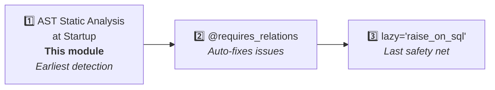

# Static Analyzer

The static analyzer uses AST analysis to scan source code **at application startup**, detecting code that could cause `MissingGreenlet` errors before any request is served.

## Purpose

This is the **first line of defense** against MissingGreenlet issues — scanning your code before any requests arrive to find all potential problems.



## Detection Rules

| Rule | Description |
|------|-------------|
| **RLC001** | `response_model` contains relation fields but endpoint doesn't preload |
| **RLC002** | Accessing relations after `save()`/`update()` without `load=` |
| **RLC003** | Accessing relations without prior `load=` loading (local variables only) |
| **RLC005** | Dependency function doesn't preload relations needed by `response_model` |
| **RLC007** | Accessing column attributes on expired objects after commit |
| **RLC008** | Calling methods on expired objects after commit |
| **RLC009** | Type annotation resolution errors (mixing resolved types with string forward references) |

## Usage

### Automatic Checking (Recommended)

```python
# In models/__init__.py, after configure_mappers():
from sqlmodel_ext import run_model_checks, SQLModelBase
run_model_checks(SQLModelBase)

# In main.py:
from sqlmodel_ext import RelationLoadCheckMiddleware
app.add_middleware(RelationLoadCheckMiddleware)
```

`run_model_checks` scans all model class methods. `RelationLoadCheckMiddleware` scans all FastAPI route functions when the first request arrives.

### Manual Checking

```python
from sqlmodel_ext import RelationLoadChecker

checker = RelationLoadChecker(model_base_class=SQLModelBase)
checker.check_function(some_function)
checker.check_fastapi_app(app)

for warning in checker.warnings:
    print(f"[{warning.code}] {warning.message}")
    print(f"  Location: {warning.location}")
```

## Common Warning Examples

### RLC001: response_model Not Preloaded

```python
class UserResponse(SQLModelBase):
    profile: ProfileResponse    # Relation field

@router.get("/user/{id}", response_model=UserResponse)
async def get_user(session: SessionDep, id: UUID):
    return await User.get_exist_one(session, id) # [!code warning]
    # ⚠ RLC001: response_model contains profile, but query has no load=User.profile
```

### RLC002: Accessing Relations After save

```python
async def update_user(session, id, data):
    user = await User.get_exist_one(session, id, load=User.profile)
    user = await user.update(session, data)  # Relations expire after commit // [!code warning]
    return user.profile                       # RLC002 // [!code error]
```

### RLC007: Accessing Columns After commit

```python
async def create_and_log(session, data):
    user = User(**data)
    session.add(user)
    await session.commit()     # user expires // [!code warning]
    print(user.name)           # RLC007 // [!code error]
```

## `RelationLoadWarning`

Each warning contains:

| Property | Description |
|----------|-------------|
| `code` | Rule code (e.g., "RLC001") |
| `message` | Human-readable description |
| `location` | Location (e.g., "module.py:42 in function_name") |
| `severity` | "warning" or "error" |

## Limitations

- **False positives**: Cannot track runtime dynamic behavior (e.g., `getattr`, conditional loading)
- **Coroutines only**: Synchronous functions are not analyzed
- **Module scope**: Only analyzes imported modules; unimported code is not scanned
