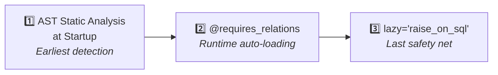

# Relation Preloading

In async SQLAlchemy, accessing an unloaded relation triggers an implicit synchronous query, causing a `MissingGreenlet` error. The `@requires_relations` decorator solves this problem.

## The Problem

```python
class MyFunction(SQLModelBase, UUIDTableBaseMixin, table=True):
    generator: Generator = Relationship()

    async def calculate_cost(self, session) -> int:
        config = self.generator.config    # MissingGreenlet! // [!code error]
        return config.price * 10
```

The conventional workaround is to use `load=` when calling, but **the caller must know which relations the method needs internally**.

## `@requires_relations` Decorator

Declare relation requirements on the method itself:

```python
from sqlmodel_ext.mixins import RelationPreloadMixin, requires_relations

class MyFunction(SQLModelBase, UUIDTableBaseMixin, RelationPreloadMixin, table=True):
    generator: Generator = Relationship()

    @requires_relations('generator', Generator.config) # [!code highlight]
    async def calculate_cost(self, session) -> int:
        # generator and generator.config are auto-loaded before execution
        return self.generator.config.price * 10
```

Callers don't need to worry about internal dependencies:

```python
cost = await func.calculate_cost(session)  # Automatically loads required relations
```

### Parameter Format

```python
@requires_relations(
    'generator',         # String: attribute name on this class
    Generator.config,    # RelationshipInfo: relation attribute on an external class (nested)
)
```

- **String** — direct relations like `self.generator`
- **RelationshipInfo** — `Generator.config` represents nested relations

## Key Features

| Feature | Description |
|---------|-------------|
| **Declarative** | Relation requirements declared on the method, not at the call site |
| **Incremental loading** | Already loaded relations are not re-loaded |
| **Import-time validation** | Misspelled relation names error immediately at startup |
| **Auto session discovery** | Session parameter position is not forced, auto-discovered from arguments |
| **Nesting-aware** | Automatically handles multi-level relation chains |
| **Async generator support** | Works with `async for` too |

## `@requires_for_update` Decorator

Declares that a method must be called on a `FOR UPDATE` locked instance:

```python
from sqlmodel_ext.mixins.relation_preload import requires_for_update

class Account(SQLModelBase, UUIDTableBaseMixin, RelationPreloadMixin, table=True):
    balance: int

    @requires_for_update
    async def adjust_balance(self, session: AsyncSession, *, amount: int) -> None:
        self.balance += amount
        await self.save(session)
```

Callers must acquire the lock first:

```python
account = await Account.get(session, Account.id == uid, with_for_update=True)
await account.adjust_balance(session, amount=-100)  # OK // [!code ++]

account = await Account.get_exist_one(session, uid)
await account.adjust_balance(session, amount=-100)  # RuntimeError! // [!code error]
```

At runtime, the lock status is checked via `session.info`. The static analyzer can also detect unlocked calls at startup.

## Default `lazy='raise_on_sql'`

Starting from 0.2.0, all Relationship fields default to `lazy='raise_on_sql'`. This means accessing an unpreloaded relation in an async environment will **raise an exception immediately** rather than triggering an implicit query. This is the last safety net against MissingGreenlet issues.

## Manual API

Usually not needed — the decorator handles everything. A manual interface is provided for special scenarios:

```python
# Get the list of relations declared for a method (for building queries)
rels = MyFunction.get_relations_for_method('calculate_cost')

# Get relations for multiple methods (deduplicated)
rels = MyFunction.get_relations_for_methods('calculate_cost', 'validate')

# Manual preloading
await instance.preload_for(session, 'calculate_cost', 'validate')
```

## Three Lines of Defense

sqlmodel-ext provides three layers of protection against MissingGreenlet issues:


