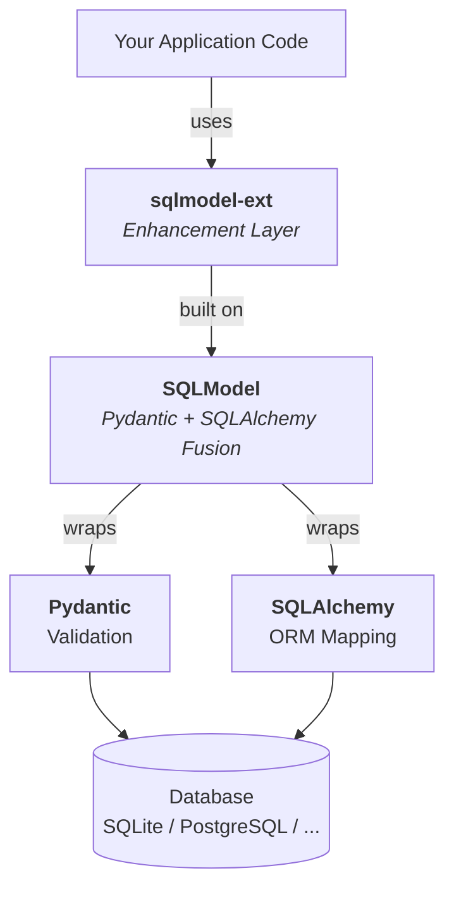

# Architecture Overview

This section dives deep into the implementation internals of sqlmodel-ext, intended for developers who want to understand the framework's inner workings.

::: tip Tip
If you just want to use the framework, the [Guide](/en/guide/) is all you need. This section is for readers interested in implementation details.
:::

## Tech Stack Layers



## File Structure

```
sqlmodel_ext/
├── __init__.py              # Public API entry, re-exports all public symbols
├── base.py                  # SQLModelBase + custom metaclass __DeclarativeMeta
├── _compat.py               # Python 3.14 (PEP 649) compatibility monkey patch
├── _sa_type.py              # Extract SQLAlchemy column types from Annotated type annotations
├── _utils.py                # now() / now_date() timestamp utilities
├── _exceptions.py           # RecordNotFoundError
├── pagination.py            # ListResponse / TimeFilterRequest / TableViewRequest
├── relation_load_checker.py # AST static analyzer (~2000 lines)
├── mixins/
│   ├── table.py             # TableBaseMixin / UUIDTableBaseMixin (all CRUD)
│   ├── cached_table.py      # CachedTableBaseMixin (Redis cache layer, ~1700 lines)
│   ├── polymorphic.py       # PolymorphicBaseMixin / AutoPolymorphicIdentityMixin
│   ├── optimistic_lock.py   # OptimisticLockMixin / OptimisticLockError
│   ├── relation_preload.py  # RelationPreloadMixin / @requires_relations / @requires_for_update
│   └── info_response.py     # Id/Datetime response DTO Mixins
└── field_types/
    ├── __init__.py           # Str64 / Port type aliases
    ├── url.py                # Url / HttpUrl / SafeHttpUrl / WebSocketUrl
    ├── ip_address.py         # IPAddress
    ├── _ssrf.py              # SSRF security validation
    ├── _internal/path.py     # Path type handlers
    ├── mixins/               # ModuleNameMixin
    └── dialects/postgresql/  # Array[T] / JSON100K / NumpyVector
```

## Core Design Philosophy

sqlmodel-ext's design revolves around one core goal: **Let users declaratively define models, and the framework automatically handles all details behind the scenes.**

Key techniques for achieving this:

| Technique | Application | Details |
|-----------|-------------|---------|
| Custom metaclass | Auto `table=True`, JTI/STI detection, sa_type extraction | [Metaclass & SQLModelBase](./metaclass) |
| Mixin pattern | CRUD, optimistic locking, polymorphism, relation preloading | Individual feature chapters |
| `__init_subclass__` | Import-time validation (relation names, polymorphic config) | [Relation Preloading](./relation-preload), [Polymorphic Inheritance](./polymorphic) |
| AST static analysis | Detect MissingGreenlet risks at startup | [Static Analyzer](./relation-load-checker) |
| `__get_pydantic_core_schema__` | Custom types satisfying both Pydantic + SQLAlchemy | [Metaclass & SQLModelBase](./metaclass) |
| Redis cache layer | Dual-layer cache + auto invalidation + invalidation compensation | [Redis Caching](./cached-table) |

## Reading Order

We recommend starting with [Prerequisites](./prerequisites), then following this order:

| Order | Chapter | Difficulty | Core Files |
|-------|---------|-----------|------------|
| 1 | [Prerequisites](./prerequisites) | Background | — |
| 2 | [Metaclass & SQLModelBase](./metaclass) | Medium | `base.py`, `_sa_type.py`, `_compat.py` |
| 3 | [CRUD Implementation](./crud) | Core | `mixins/table.py` |
| 4 | [Polymorphic Inheritance](./polymorphic) | Advanced | `mixins/polymorphic.py` |
| 5 | [Optimistic Locking](./optimistic-lock) | Medium | `mixins/optimistic_lock.py` |
| 6 | [Relation Preloading](./relation-preload) | Medium | `mixins/relation_preload.py` |
| 7 | [Redis Caching](./cached-table) | Advanced | `mixins/cached_table.py` |
| 8 | [Static Analyzer](./relation-load-checker) | Advanced | `relation_load_checker.py` |
