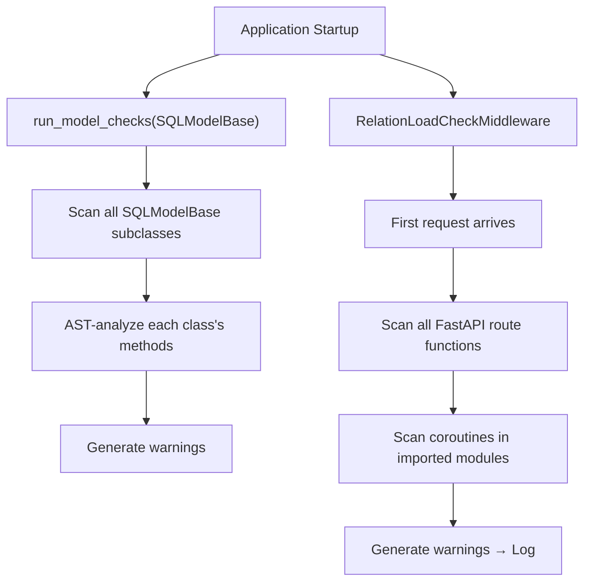

# Static Analyzer

::: tip Tip
`src/sqlmodel_ext/relation_load_checker.py` — `RelationLoadChecker`, `RelationLoadCheckMiddleware`, `run_model_checks`
:::

This is the **most complex module** in the entire project (~2000 lines), using AST static analysis to discover potential `MissingGreenlet` issues at application startup.

## Core Class

```python
class RelationLoadChecker:
    def __init__(self, model_base_class=None):
        self.model_base_class = model_base_class
        self.warnings: list[RelationLoadWarning] = []
```

Uses Python's `ast` module to parse source code's **abstract syntax tree**, rather than executing code:
- No database connection needed
- No business logic execution required
- Can be completed during the import phase

## Analysis Flow



## Detection Rules Explained

### RLC001: response_model Contains Relation Fields but Endpoint Doesn't Preload

The analyzer:
1. Parses `response_model=UserResponse`, finds it contains a `profile` field
2. Checks query calls in the endpoint function body, finds no `load=` parameter
3. Generates a warning

```python
@router.get("/user/{id}", response_model=UserResponse)
async def get_user(session: SessionDep, id: UUID):
    return await User.get_exist_one(session, id) # [!code warning]
    # ⚠ RLC001: response_model contains profile, but query has no load=
```

### RLC002: Accessing Relations After save/update

Tracks variable "expiration state" — after a `save()` or `update()` call, all relations on the object are considered expired.

```python
user = await User.get_exist_one(session, id, load=User.profile)
user = await user.update(session, data)   # All relations expire after this // [!code warning]
return user.profile                        # RLC002 // [!code error]
```

### RLC003: Accessing Unloaded Relations (Local Variables)

Tracks the object types and loaded relations bound to local variables, detecting attribute access on unloaded relations.

### RLC007: Accessing Expired Object Column Attributes After commit

Tracks `session.commit()` calls — accessing any attribute on related objects afterward is considered dangerous.

### RLC008: Calling Methods on Expired Objects After commit

Similar to RLC007, but detects method calls rather than attribute access.

### RLC009: Type Annotation Resolution Errors

Detects issues caused by mixing resolved types with string forward references.

## `RelationLoadWarning`

```python
class RelationLoadWarning:
    code: str          # "RLC001"
    message: str       # Human-readable description
    location: str      # "module.py:42 in function_name"
    severity: str      # "warning" or "error"
```

## `mark_app_check_completed()`

The middleware check executes only once. After analysis is complete on the first request, `mark_app_check_completed()` marks it as done, and subsequent requests don't repeat the check.

## Why AST Instead of Runtime Checks?

| Approach | Pros | Cons |
|----------|------|------|
| AST static analysis | Finds issues at startup, no code execution, covers all paths | Possible false positives, can't analyze dynamic code |
| Runtime checks | 100% accurate | Only checks executed paths |

The static analyzer serves as the "first line of defense" alongside runtime `@requires_relations` and `lazy='raise_on_sql'`, forming multi-layer protection.

## Limitations

- **False positives**: Static analysis cannot track runtime dynamic behavior (e.g., `getattr`, conditional loading)
- **Coroutines only**: Synchronous functions are not analyzed (no MissingGreenlet issue in sync environments)
- **Module scope**: Only analyzes imported modules; unimported code is not scanned
