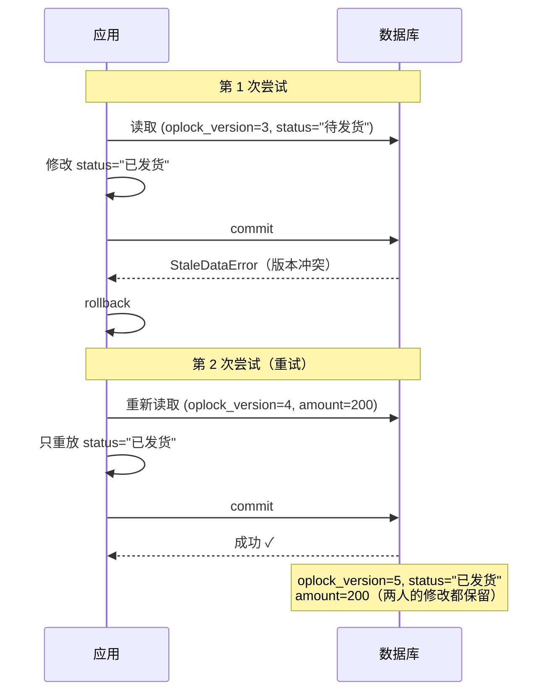

# 乐观锁机制

::: tip 源码位置
`src/sqlmodel_ext/mixins/optimistic_lock.py` — `OptimisticLockMixin` 和 `OptimisticLockError`

元类接线在 `src/sqlmodel_ext/base.py`；重试逻辑在 `src/sqlmodel_ext/mixins/table.py` 的 `save()` / `update()` / `delete()`
:::

## 设计动机

并发更新同一条记录会导致**丢失更新**：A 改了 status，B 同时改了 amount，谁后写谁就覆盖了对方的修改。乐观锁通过版本号检测这种冲突，让冲突可被识别、可被重试，而不是静默丢数据。

想知道**怎么用**？去 [处理并发更新](/how-to/handle-concurrent-updates)。本章只解释**为什么这么实现**。

## 版本列：`oplock_version`

```python
class OptimisticLockMixin:
    __optimistic_retry_default__: ClassVar[int] = 3
    _has_optimistic_lock: ClassVar[bool] = True

    oplock_version: Annotated[
        int,
        Field(
            default=OPLOCK_INITIAL_VERSION,           # 0
            ge=0, le=JS_MAX_SAFE_INTEGER,
            sa_type=BigInteger,
            sa_column_kwargs={'server_default': text('0')},
            exclude=True,
        ),
    ] = OPLOCK_INITIAL_VERSION
```

每个设计选择都对应一个真实问题：

| 选择 | 原因 |
|------|------|
| 列名 `oplock_version` 而不是 `version` | 不和领域字段 `version` 撞名。这个名字是**全局保留**的：任何模型在自己类体里声明它，元类当场抛 `TypeError`——否则一个没启用锁的类可以声明同名领域列，而某个子孙重新启用锁时会把它静默接线成 `version_id_col` |
| `BIGINT` + 上限 `JS_MAX_SAFE_INTEGER` | 高频更新的行没有 INTEGER 溢出的现实风险；上限对 JS 客户端安全 |
| `exclude=True` | 版本列是 ORM 内部状态，不应泄漏到 `model_dump()`（例如泄漏进 `extra='forbid'` 的响应 DTO） |
| `server_default` | 滚动部署期间，旧版本实例不认识这一列、INSERT 时不写它；数据库默认值让这些 INSERT 依然合法 |
| 默认值写在 `Annotated` 的 `Field` 里 | Mixin 是普通类（没有 `model_fields`），只靠 `=` 赋值的默认值在元类恢复 Annotated 字段时会丢失 |

元类看到任一基类带 `_has_optimistic_lock=True` 时，在**根表** mapper 上把这一列注册为 SQLAlchemy 的 `version_id_col`（STI/JTI 子类经 mapper 继承共享）。于是每次 UPDATE 生成：

```sql
UPDATE ... SET ..., oplock_version = oplock_version + 1
WHERE id = ? AND oplock_version = ?
```

WHERE 不匹配（别的事务已经改过）→ 影响 0 行 → `StaleDataError`。

## 重试策略属于模型，不属于调用点

```python
class TableBaseMixin:
    __optimistic_retry_default__: ClassVar[int] = 0

class OptimisticLockMixin:
    __optimistic_retry_default__: ClassVar[int] = 3
```

`save()` / `update()` 的 `optimistic_retry_count` 默认是 `None`，表示"用模型策略"：

```python
retries_remaining = (
    optimistic_retry_count if optimistic_retry_count is not None
    else cls.__optimistic_retry_default__
)
```

- **为什么不是每个调用点传参数**：策略应当活在声明能力的地方。靠每个调用点记得传 `optimistic_retry_count=3`，就是在第二个地方重复声明同一个事实——总有一处会忘。
- **为什么基类是 0**：没有乐观锁的模型出现 `StaleDataError` 只可能意味着"UPDATE 命中 0 行 = 行已经不存在"，重试只会再报一次"已删除"。
- **为什么 Mixin 是 3 而不是更多**：每次重试都是完整的 rollback + 重读 + 重写；持续冲突说明真的有争用，更多重试只会更久地占着连接。
- **为什么默认值不能写成 0**：显式 `0` 必须仍然表示"不要重试"，所以"没传"需要一个不同于 0 的载体——`None`。
- **MRO 要求**：`OptimisticLockMixin` 必须放在 `TableBaseMixin` / `UUIDTableBaseMixin` **之前**，它的 `__optimistic_retry_default__` 才会覆盖基类的 0。

## `save()` 中的重试

```python
while True:
    # 在 flush 之前快照标量状态：失败的带版本 UPDATE 会回滚内层事务、
    # 使所有属性过期，except 块里再读属性会发 SQL（PendingRollbackError / MissingGreenlet）。
    instance_id = <从 identity 或 __dict__ 读取>
    instance_version = instance.__dict__.get('oplock_version')
    if retries_remaining > 0 and current_data is None:
        # 只记录调用方真正修改过的列（SQLAlchemy 属性历史）
        current_data = {列: 值 for 列 in 有变更的列 if 列 not in ('id', 'oplock_version', 'created_at', 'updated_at')}

    session.add(instance)
    try:
        await session.commit()
        break
    except StaleDataError as e:
        await session.rollback()
        if retries_remaining <= 0:
            raise OptimisticLockError(..., record_id=..., expected_version=instance_version) from e
        retries_remaining -= 1
        fresh = await cls.get(session, cls.id == instance_id)
        if fresh is None:
            raise OptimisticLockError("... record has been deleted", ...) from e
        for key, value in current_data.items():
            setattr(fresh, key, value)
        instance = fresh
```

### 为什么只重放"我改过的列"

早期实现用整份 `model_dump()` 作为重放数据。那会把**你读到的旧值**连同你的修改一起写回，覆盖掉另一个事务刚提交的其它列——正是乐观锁要防止的丢失更新，只是换了个地方发生。现在用 SQLAlchemy 的属性历史（`history.has_changes()`）只收集调用方实际修改过的列；对新建实例，所有被赋值的属性都有历史，因此同样覆盖 INSERT。

`update()` 的重试更简单：它的"改动"本来就是 `other.model_dump(...)`，重读最新行后再 `sqlmodel_update` 一次即可。

### 为什么在 flush 之前快照

冲突发生时内层事务已经回滚，实例的所有属性都已过期。`except` 块里任何属性读取都会发 SQL，而此时 session 处于待回滚状态或在异步上下文外——所以 id 与版本号必须在尝试 flush **之前**通过 identity / `__dict__`（不触发加载）取好。

### 重试流程



## `delete()` 的冲突：归一，但不重试

带版本的模型，`DELETE` 同样带 `WHERE oplock_version = ?`。命中 0 行时 `delete()` 把 `StaleDataError` 转成 `OptimisticLockError`，但：

- **永不重试**。"刚刚有人改了它——我还要删吗？"是调用方的决定，不是框架能替你做的。
- **`record_id` 与 `expected_version` 恒为 `None`**。flush 覆盖整个 session：冲突可能来自删除目标，也可能来自同一次 flush 里另一个对象的带版本 UPDATE。把删除目标写进 `record_id` 会把别人的冲突错误地归到它头上。`model_class` 是**调用方**模型。
- **不回滚**：事务属于调用方。
- 条件模式（`delete(condition=...)`）不会抛：批量 DELETE 没有逐行版本检查。

## `OptimisticLockError`

```python
class OptimisticLockError(Exception):
    def __init__(self, message, model_class=None, record_id=None,
                 expected_version=None, original_error=None): ...
```

携带 `model_class` / `record_id` / `expected_version` / `original_error`（原始 `StaleDataError`），方便日志与排障。各来源填哪些字段见 [Mixin 参考](/reference/mixins#optimisticlockerror)。

## 两阶段上线

`_has_optimistic_lock` 可以在一个**中间基类**上覆盖为 `False`：模型带上 `oplock_version` 列，但元类不接线 `version_id_col`。这让"先上线列、再上线锁行为"成为两次独立部署——第一次部署时旧实例与新实例都不做版本检查，列由 `server_default` 填好；第二次部署再打开检查。
