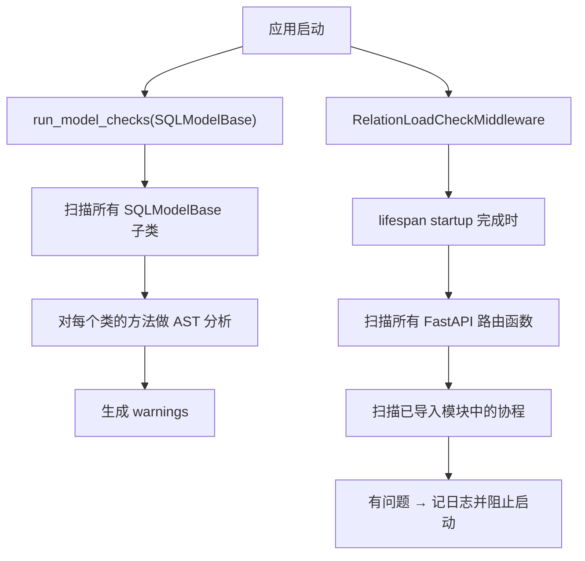

# 静态分析器原理

::: tip 源码位置
`src/sqlmodel_ext/relation_load_checker.py` — `RelationLoadChecker`、`RelationLoadCheckMiddleware`、`run_model_checks`
:::

这是整个项目中**最复杂的模块**，通过 AST 静态分析在应用启动时发现潜在的 `MissingGreenlet` 问题。

::: warning 实验性，默认关闭
这个模块被视为**实验性**，需要 `rlc.check_on_startup = True` 显式开启；模块 API 不在 semver 稳定承诺范围内。本章解释它**怎么工作**，要看怎么在项目里启用，去 [防止 MissingGreenlet 错误](/how-to/prevent-missing-greenlet)。
:::

## 核心类

```python
class RelationLoadChecker:
    def __init__(self, base_class: type) -> None: ...

    def check_model_methods(self) -> list[RelationLoadWarning]: ...
    def check_app(self, app: Any) -> list[RelationLoadWarning]: ...
    def check_project_coroutines(
        self,
        project_root: str,
        skip_paths: list[str] | None = None,
        skip_third_party_attrs: bool = False,
        params_share_session: bool = True,
    ) -> list[RelationLoadWarning]: ...
    def check_function(self, func: Any) -> list[RelationLoadWarning]: ...
```

构造时从 SQLAlchemy mapper 建立知识库（每个模型的关系、列、关系目标），然后**自动发现**方法行为——把类型系统当作唯一真相源：

| 属性 | 含义 |
|------|------|
| `commit_methods` | 会（传递地）commit 的方法名 |
| `model_returning_methods` / `sync_model_returning_methods` | 返回模型实例的方法 |
| `refreshing_commit_methods` | 返回值来自 `save` / `update`（已刷新）的 commit 方法 |
| `detaching_methods` | 会（传递地）调用 `session.reset()` 的方法 |

使用 Python 的 `ast` 分析源码，不执行代码：不需要数据库连接、不运行业务逻辑。

## 分析流程



`run_model_checks()` 发现问题时抛 `RuntimeError` 阻止启动（在 pytest 环境里只告警）。中间件在 lifespan 启动完成后运行一次端点与协程检查，有问题同样抛 `RuntimeError`。

## 检测规则

| 规则 | 检测 |
|------|------|
| RLC001 | `response_model` 包含关系字段，但端点查询没有预加载 |
| RLC002 | `save()` / `update()` 之后访问关系，且没有传 `load=` |
| RLC003 | 访问未加载的关系（只针对本地获得的变量） |
| RLC005 | 依赖函数没有预加载 `response_model` 需要的关系 |
| RLC007 | commit 后访问过期对象的列属性 |
| RLC008 | commit 后调用过期对象的方法（方法内部可能访问过期列） |
| RLC009 | 类型注解解析失败（混用已解析类型与字符串前向引用） |
| RLC010 | 把 commit 后的过期对象当参数传给函数 / 方法 |
| RLC011 | 隐式 dunder 触发关系访问（`if not obj:` → `__len__()`，`for x in obj:` → `__iter__()`） |
| RLC012 | `response_model` 含 STI 子类专有列，而端点返回的是 STI 基类查询结果 |
| RLC013 | async generator 在 `yield` 之后访问列属性（消费方可能在 yield 期间用同一 session commit） |
| RLC014 | 某个 FastAPI `Depends` 在函数体内 commit，于是**兄弟**依赖注入的 ORM 对象在端点开始时已经过期 |

### RLC014：依赖边界上的 commit

```python
async def get_article(session: SessionDep, article_id: UUID) -> Article:
    return await Article.get_exist_one(session, article_id)

async def touch_last_seen(session: SessionDep, user: CurrentUserDep) -> None:
    user.last_seen_at = datetime.now(timezone.utc)
    await user.save(session)                      # commit → 整个 session 的对象都过期

@router.get("/articles/{article_id}")
async def read_article(
    article: Annotated[Article, Depends(get_article)],
    _: Annotated[None, Depends(touch_last_seen)],
) -> ArticleResponse:
    return ArticleResponse(title=article.title)   # RLC014：article 已过期
```

依赖的解析顺序没有保证，而 `expire_on_commit=True` 让一次 commit 过期 session 里的**所有**对象，所以任何依赖内部的 commit 都会让其它依赖注入的对象过期。哪些方法名算"依赖里的 commit"由模块级配置 `dependency_commit_methods` 决定（见下）。

## 过期建模的前提

RLC007 / 008 / 010 / 013 / 014 共享以下建模前提：

1. **session 参数按子类识别，不按身份**。注解为 sqlmodel `AsyncSession` 任意子类（包括 `sqlmodel_ext.AsyncSession`）的参数都算 session 参数。按身份判断会让所有注解为子类的方法在 commit / detach / 返回模型的发现中都不可见。字符串前向引用只接受**恰好**是 `'AsyncSession'` 的段——不做模糊匹配，因为无关的 HTTP 客户端也常叫 `AsyncSession`。
2. **按 session 身份过期**。只有传给 commit 方法的 session 是被分析函数**自己的** session 参数时，commit 才让被跟踪的对象过期；传一个短生命周期的本地 session（`async with factory() as s`）不会让签名 session 上的对象过期。有多个 session 参数时，commit 一个只让绑定在它上面的对象过期。
3. **两种条件 commit**（语义不同，分开配置）：
   - `conditional_commit_methods`：只在缓存未命中时 commit、稳态下是纯读取的方法（懒创建单例、幂等 get-or-create）。调用点分不出命中与否，所以整个方法**排除**出 commit 发现——接受漏掉罕见的未命中 commit，换来稳态零误报。
   - `explicit_commit_methods`：声明为 `commit: bool = False`、只在调用方传 `commit=True` 时 commit 的方法。调用点**能**分辨，所以每次调用按自己的参数判定：只有字面量 `commit=True` 算 commit；动态值当作"不 commit"（无法证明为真）。
   - 经验法则：调用点能静态看出这次调用会不会 commit，用后者；否则用前者。
4. **reset 后 detached**。`session.reset()`（直接或经由 detaching 方法）之后对象是 detached 的：已加载的列值仍可读，之后的 commit **不能**再让它们过期。否则"reset 释放连接 → 短 session 持久化 → 继续读 detached 对象的列"这一正确模式会被误报为 RLC007/010。
5. **测试代码按 pytest fixture 解析**。`check_project_coroutines(params_share_session=False)` 时，测试函数的模型参数当且仅当其 fixture 的传递依赖闭包消费了测试自己请求的某个 session fixture **名字**时，才视为共享 session；临时构造、自己开 session 的 fixture、找不到定义的 fixture 都建模为 detached。默认 `True` 适用于生产代码（依赖 / 调用方在同一 session 上组装参数，函数体里的 commit 会让它们过期）。

## 模块级配置

```python
import sqlmodel_ext.relation_load_checker as rlc

rlc.check_on_startup = True
rlc.conditional_commit_methods = frozenset({'get_or_create'})
rlc.explicit_commit_methods = frozenset({'enqueue'})
rlc.dependency_commit_methods = rlc.dependency_commit_methods | {'approve'}
```

| 配置 | 默认值 | 说明 |
|------|------|------|
| `check_on_startup` | `False` | 总开关；关闭时 `run_model_checks`、中间件与所有自动检查立即返回 |
| `conditional_commit_methods` | `frozenset()` | 见上文前提 3；按方法名跨所有类匹配，只列在整个项目里都有这种语义的名字 |
| `explicit_commit_methods` | `frozenset()` | 见上文前提 3。`commit` 参数默认为 `True` 的方法（本库的 `save` / `update` / `delete` / `add`）**不要**列在这里 |
| `dependency_commit_methods` | `{'add', 'save', 'update', 'delete'}` | 在 FastAPI 依赖内被调用即触发 RLC014 的方法名。只放（几乎）总会 commit 的方法；还必须同时是自动发现的 commit 方法才生效（与 `commit_methods` 取交集，防同名的非 commit 方法） |

`RelationLoadChecker.detaching_methods` 是自动发现的结果（不是配置），用于判定 detach 豁免。

## 端点分析的细节

- **判别联合真正绑定**：`Annotated[A | B | C, Discriminator(...)]` 形式的 `response_model` 会用判别字段的 `Literal` 值把每个成员绑定到它实际序列化的 STI 子类，再分别检查。
- **容器下钻**：`ListResponse[X]`、命名的分桶 / 分页模型（字段里是 DTO 列表），通过**字段注解**下钻到元素 DTO（`typing.get_origin/get_args` 对 Pydantic 具体泛型和命名容器都拿不到信息）；Union（`A | B`）逐个成员合并。
- **`load=` 在运行时解析**：依赖工厂的闭包自由变量（`require_x(X, load=rel(X.y))` 返回的检查器体里写的是 `load=load`）、从其它模块导入的常量（`load=PRELOAD`）、`functools.partial` 绑定的参数——这些 AST 看不到的形态，从函数的**运行时命名空间**解析。名字归属遵循 CPython 自己的规则（`co_freevars` / `co_varnames`）：局部名**永远不会**去全局里找，否则一个同名全局常量会掩盖真实的漏加载。

## `# noqa` 抑制

```python
return result  # noqa: RLC007
return result  # noqa: RLC007, RLC010
```

`check_app` / `check_model_methods` / `check_project_coroutines` / `check_function` 返回的**每条** warning 都已经过 `# noqa: RLCxxx` 过滤。`# noqa` 写在 warning **报告的那一行**：

- 指向具体访问的规则（例如 RLC007、RLC014）报告访问所在的行，`# noqa` 写在那一行；
- 端点级规则（例如 RLC005：依赖与端点体里都找不到对应的 `load=`）锚定在 `inspect.getsourcelines` 返回的第一行——它包括装饰器——所以要写在**第一个装饰器那一行**：

```python
@router.get("/x", response_model=XResponse)  # noqa: RLC005
async def x(...): ...
```

## `RelationLoadWarning`

```python
@dataclass
class RelationLoadWarning:
    code: str       # "RLC001" ~ "RLC014"
    file: str
    line: int
    message: str
    # str(w) == "[RLC001] path/to/file.py:42 - ..."
```

## `mark_app_check_completed()`

中间件的检查只执行一次，完成后通过 `mark_app_check_completed()` 标记。开启了检查、模型检查跑了而端点检查没跑时，进程退出时会在 stderr 提醒你加中间件。

## 为什么用 AST 而不用运行时检查？

| 方式 | 优点 | 缺点 |
|------|------|------|
| AST 静态分析 | 启动时发现、不执行代码、覆盖所有路径 | 可能有误报、无法分析动态代码 |
| 运行时检查 | 100% 准确 | 只有执行到的路径才会检查 |

静态分析器作为"第一道防线"，配合运行时的 `@requires_relations` 和 `lazy='raise_on_sql'` 形成多层保护。

## 已知限制

- **不继承 table 类的响应 DTO 检测不到 RLC001 / RLC005 需求**：对一个 DTO，分析器以其 MRO 中**最近的 table 模型**判断字段是否对应关系。完全独立声明、不继承任何 table 类的响应 DTO 没有这样的锚点，它需要的关系不会被识别。
- **误报**：静态分析无法追踪运行时的动态行为（`getattr`、条件加载）。
- **仅分析协程**：同步函数不在分析范围内。
- **模块范围**：只分析已导入的模块。
- **项目结构假设**：AST 规则针对特定结构（FastAPI 端点、STI 继承约定、`save` / `update` / `delete` 命名）调优，在不同项目上可能产生误报或解析失败。
