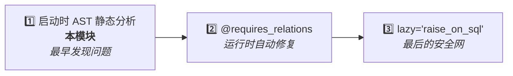

# 静态分析器

::: warning 实验性功能（默认关闭）
关系加载静态分析器从 0.3.0 起被视为**实验性功能**，默认 `check_on_startup = False`，所有自动检查入口（`run_model_checks`、`RelationLoadCheckMiddleware`、`atexit` 警告）都会立即短路、不会影响应用启动。

分析器的 AST 规则是针对特定项目结构（FastAPI 端点、STI 继承约定、`save`/`update`/`delete` 命名等）调优的，在不同项目上**可能产生误报或解析失败**。只有在你确认项目结构与下面文档描述的假设一致后，才应显式启用：

```python
import sqlmodel_ext.relation_load_checker as rlc
rlc.check_on_startup = True  # 显式启用，实验性
```

此模块的 API 不在 semver 稳定承诺范围内，后续版本可能调整规则或签名。
:::

静态分析器在**应用启动时**通过 AST 分析源码，提前发现可能导致 `MissingGreenlet` 错误的代码。

## 定位

这是 MissingGreenlet 问题的**第一道防线**——在任何请求到来之前，扫描你的代码，找出所有潜在问题。



## 检测规则

| 规则 | 说明 |
|------|------|
| **RLC001** | `response_model` 包含关系字段但端点未预加载 |
| **RLC002** | `save()`/`update()` 之后访问关系但没用 `load=` |
| **RLC003** | 访问关系但之前没有用 `load=` 加载（仅本地变量） |
| **RLC005** | 依赖函数未预加载 `response_model` 需要的关系 |
| **RLC007** | commit 后访问过期对象的列属性（同步懒加载 → MissingGreenlet） |
| **RLC008** | commit 后在过期对象上调用业务方法（方法内部可能访问过期列） |
| **RLC010** | commit 后将过期 ORM 对象作为参数传给其他函数/方法 |
| **RLC011** | 隐式 dunder（`if not obj:` → `__len__`、`for x in obj:` → `__iter__`）触发关系访问 |
| **RLC012** | `response_model` 含 STI 子类专属列但端点返回基类查询结果（异构序列化访问缺失列） |

## 使用方式

### 自动检查（需显式启用）

```python
# 1. 在应用最早的入口（如 settings / bootstrap）显式启用
import sqlmodel_ext.relation_load_checker as rlc
rlc.check_on_startup = True  # 实验性，默认关闭

# 2. 在 models/__init__.py 中，configure_mappers() 之后：
from sqlmodel_ext import run_model_checks, SQLModelBase
run_model_checks(SQLModelBase)

# 3. 在 main.py 中：
from sqlmodel_ext import RelationLoadCheckMiddleware
app.add_middleware(RelationLoadCheckMiddleware)
```

`run_model_checks` 扫描所有模型类的方法，`RelationLoadCheckMiddleware` 在 lifespan startup 完成时扫描 FastAPI 路由。若没有设置 `check_on_startup = True`，两个入口都会立即返回，不会做任何事情。

### 手动检查

```python
from sqlmodel_ext import RelationLoadChecker

checker = RelationLoadChecker(model_base_class=SQLModelBase)
checker.check_function(some_function)
checker.check_fastapi_app(app)

for warning in checker.warnings:
    print(f"[{warning.code}] {warning.message}")
    print(f"  位置: {warning.location}")
```

## 常见警告示例

### RLC001：response_model 未预加载

```python
class UserResponse(SQLModelBase):
    profile: ProfileResponse    # 关系字段

@router.get("/user/{id}", response_model=UserResponse)
async def get_user(session: SessionDep, id: UUID):
    return await User.get_exist_one(session, id) # [!code warning]
    # ⚠ RLC001: response_model 包含 profile，但查询没有 load=User.profile
```

### RLC002：save 后访问关系

```python
async def update_user(session, id, data):
    user = await User.get_exist_one(session, id, load=User.profile)
    user = await user.update(session, data)  # commit 后关系过期 // [!code warning]
    return user.profile                       # RLC002 // [!code error]
```

### RLC007：commit 后访问列

```python
async def create_and_log(session, data):
    user = User(**data)
    session.add(user)
    await session.commit()     # user 过期 // [!code warning]
    print(user.name)           # RLC007 // [!code error]
```

## `RelationLoadWarning`

每个警告包含：

| 属性 | 说明 |
|------|------|
| `code` | 规则编码（如 "RLC001"） |
| `message` | 人类可读的描述 |
| `location` | 位置（如 "module.py:42 in function_name"） |
| `severity` | "warning" 或 "error" |

## 局限性

- **误报**：无法追踪运行时的动态行为（如 `getattr`、条件加载）
- **仅分析协程**：同步函数不在分析范围内
- **模块范围**：只分析已导入的模块，未导入的代码不会被扫描
