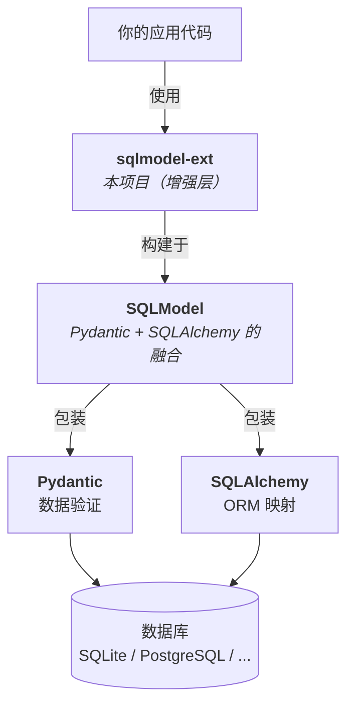

# 架构总览

本部分深入探究 sqlmodel-ext 的实现原理，适合想了解框架内部机制的开发者。

::: tip
如果你只想使用框架，阅读[指南](/guide/)即可。本部分面向对实现细节感兴趣的读者。
:::

## 技术栈层次



## 文件结构

```
sqlmodel_ext/
├── __init__.py              # 公共 API 入口，重导出所有公开符号
├── base.py                  # SQLModelBase + 自定义元类 __DeclarativeMeta
├── _compat.py               # Python 3.14 (PEP 649) 兼容性猴子补丁
├── _sa_type.py              # 从 Annotated 类型注解中提取 SQLAlchemy 列类型
├── _utils.py                # now() / now_date() 时间戳工具
├── _exceptions.py           # RecordNotFoundError
├── pagination.py            # ListResponse / TimeFilterRequest / TableViewRequest
├── relation_load_checker.py # AST 静态分析器（~2000 行）
├── mixins/
│   ├── table.py             # TableBaseMixin / UUIDTableBaseMixin（所有 CRUD）
│   ├── cached_table.py      # CachedTableBaseMixin（Redis 缓存层，~1700 行）
│   ├── polymorphic.py       # PolymorphicBaseMixin / AutoPolymorphicIdentityMixin
│   ├── optimistic_lock.py   # OptimisticLockMixin / OptimisticLockError
│   ├── relation_preload.py  # RelationPreloadMixin / @requires_relations / @requires_for_update
│   └── info_response.py     # Id/Datetime 响应 DTO Mixin
└── field_types/
    ├── __init__.py           # Str64 / Port 等类型别名
    ├── url.py                # Url / HttpUrl / SafeHttpUrl / WebSocketUrl
    ├── ip_address.py         # IPAddress
    ├── _ssrf.py              # SSRF 安全验证
    ├── _internal/path.py     # 路径类型处理器
    ├── mixins/               # ModuleNameMixin
    └── dialects/postgresql/  # Array[T] / JSON100K / NumpyVector
```

## 核心设计理念

sqlmodel-ext 的设计围绕一个核心目标：**让用户只需声明式地定义模型，框架在幕后自动处理所有细节。**

实现这个目标的关键技术：

| 技术 | 应用 | 详细章节 |
|------|------|---------|
| 自定义元类 | 自动 `table=True`、JTI/STI 检测、sa_type 提取 | [元类与 SQLModelBase](./metaclass) |
| Mixin 模式 | CRUD、乐观锁、多态、关系预加载 | 各功能章节 |
| `__init_subclass__` | 导入时验证（关系名、多态配置） | [关系预加载](./relation-preload)、[多态继承](./polymorphic) |
| AST 静态分析 | 启动时检测 MissingGreenlet 隐患 | [静态分析器](./relation-load-checker) |
| `__get_pydantic_core_schema__` | 自定义类型同时满足 Pydantic + SQLAlchemy | [元类与 SQLModelBase](./metaclass) |
| Redis 缓存层 | 双层缓存 + 自动失效 + 失效补偿 | [Redis 缓存机制](./cached-table) |

## 阅读顺序

建议先阅读[前置知识](./prerequisites)，然后按以下顺序：

| 顺序 | 章节 | 难度 | 核心文件 |
|------|------|------|---------|
| 1 | [前置知识](./prerequisites) | 背景 | — |
| 2 | [元类与 SQLModelBase](./metaclass) | 中等 | `base.py`, `_sa_type.py`, `_compat.py` |
| 3 | [CRUD 实现](./crud) | 核心 | `mixins/table.py` |
| 4 | [多态继承机制](./polymorphic) | 高级 | `mixins/polymorphic.py` |
| 5 | [乐观锁机制](./optimistic-lock) | 中等 | `mixins/optimistic_lock.py` |
| 6 | [关系预加载机制](./relation-preload) | 中等 | `mixins/relation_preload.py` |
| 7 | [Redis 缓存机制](./cached-table) | 高级 | `mixins/cached_table.py` |
| 8 | [静态分析器原理](./relation-load-checker) | 高级 | `relation_load_checker.py` |
